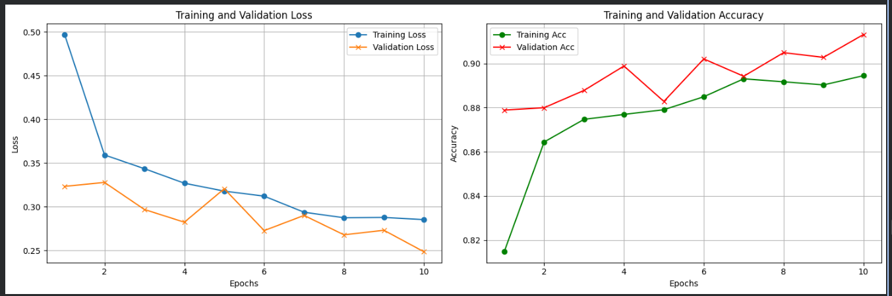
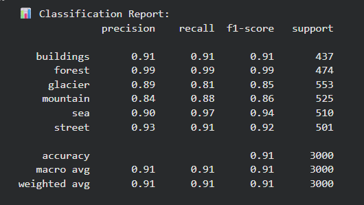
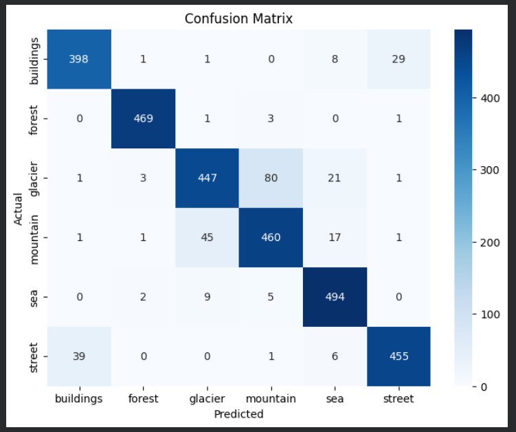
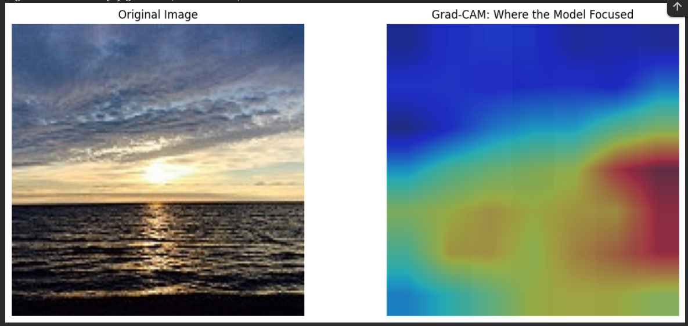
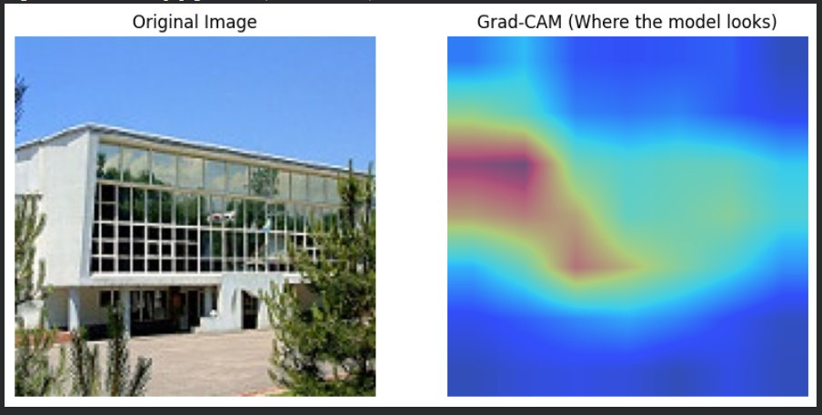
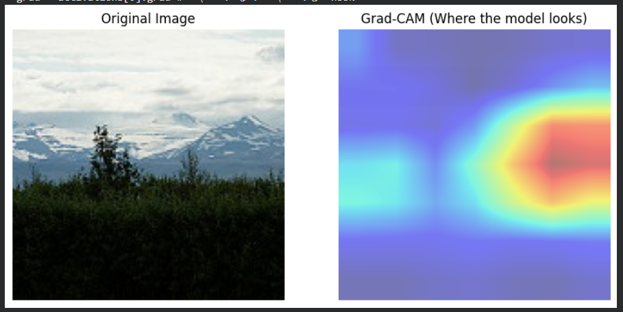
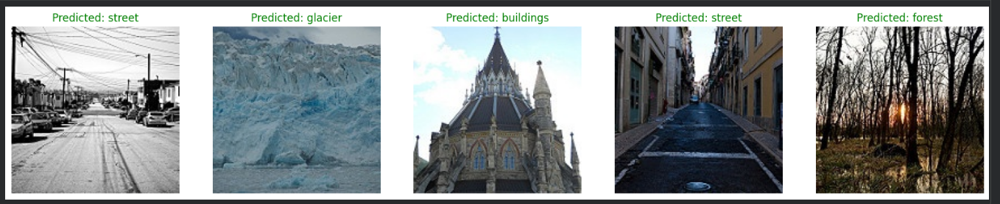
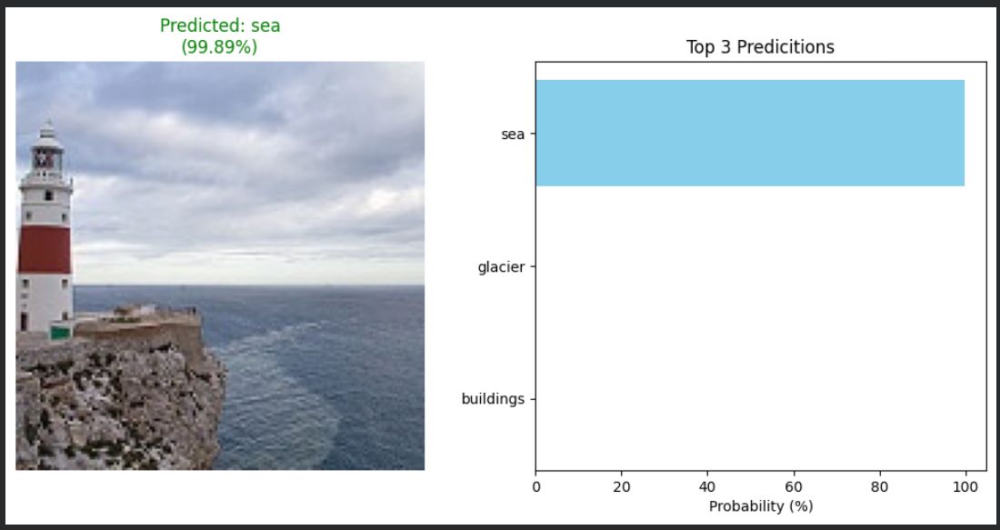

# Deep-Scene-Vision_Advanced-Image-Classification-and-Interpretability_PyTorch
Advanced Image Classification and Interpretability using PyTorch, Featuring custom CNN architectures and Grad-CAM Visualization.

​🌍 Intel Image Classification: From Pixels to Predictions with PyTorch
​💡 Project Overview: Understanding Natural Scenes through Deep Learning

​📝 Problem Statement | 
تعريف المشكلة

​English:

The challenge lies in enabling a computer to automatically and accurately distinguish between diverse natural landscapes. In a world of massive visual data, manually labeling images of mountains, forests, or streets is impossible. We need a robust system that can "see" and "understand" the defining features of these environments despite variations in lighting, angles, and weather.

​العربية

تكمن المشكلة في تمكين الكمبيوتر من التمييز التلقائي والدقيق بين المناظر الطبيعية المتنوعة. في عالم مليء بالبيانات البصرية الضخمة، يعد التصنيف اليدوي لصور الجبال أو الغابات أو الشوارع أمراً مستحيلاً. نحن بحاجة إلى نظام قوي يمكنه "رؤية" وفهم الميزات المحددة لهذه البيئات بالرغم من اختلاف الإضاءة والزوايا والظروف الجوية

​🛠️ The Solution | 
الحل البرمجي

​English:

We implemented a Deep Learning solution using Transfer Learning with the ResNet50 architecture. By using a model pre-trained on millions of images, we leverage existing knowledge to achieve high accuracy on our specific dataset. We also integrated Explainable AI (Grad-CAM) to ensure the model makes decisions based on the right visual cues.

​العربية

قمنا بتنفيذ حل يعتمد على التعلم العميق (Deep Learning) باستخدام تقنية تعلم النقل (Transfer Learning) وهيكلية ResNet50. من خلال استخدام نموذج مدرب مسبقاً على ملايين الصور، استفدنا من المعرفة السابقة لتحقيق دقة عالية. كما قمنا بدمج الذكاء الاصطناعي القابل للتفسير (Grad-CAM) لضمان أن النموذج يتخذ قراراته بناءً على عناصر بصرية صحيحة

​🛤️ Roadmap: What We Will Do | 
خارطة الطريق: ماذا سنفعل؟
1.​Data Engineering: Load and split the dataset, then apply Data Augmentation (Rotation, Flips, Color Jitter).
​هندسة البيانات: تحميل وتقسيم البيانات وتطبيق تقنيات تحسين الصور (الدوران، القلب، تعديل الألوان)

​Model Building: Initialize ResNet50, freeze its backbone, and design a custom Classification Head with Dropout.
​بناء النموذج: استدعاء ResNet50، تجميد الطبقات الأساسية، وتصميم رأس تصنيف مخصص مع تقنية الـ Dropout

​Training Setup: Define CrossEntropy Loss and Adam Optimizer with a Learning Rate Scheduler.
​إعداد التدريب: تحديد دالة الفقد والمحسن مع إضافة مجدول لسرعة التعلم لضمان استقرار الأداء

​Execution: Run the Training Loop for 10 epochs, monitoring both training and validation performance.
​التنفيذ: تشغيل حلقة التدريب لـ 10 دورات مع مراقبة الأداء في التدريب والتحقق

​Visualization: Plot Loss & Accuracy curves to diagnose the learning process.
​التحليل البصري: رسم منحنيات الخطأ والدقة لتشخيص عملية التعلم

​Final Evaluation: Generate a Confusion Matrix and Classification Report for detailed metrics.
​التقييم النهائي: استخراج مصفوفة الارتباك وتقرير التصنيف للحصول على أرقام دقيقة

​XAI (Grad-CAM): Visualize where the model "looks" to confirm its intelligence.
​تفسير النموذج: استخدام تقنية Grad-CAM لرؤية المناطق التي يركز عليها النموذج لضمان ذكائه

​📊 Model Performance & Visual Results
​To demonstrate the model's reliability and transparency, we provide the following metrics and interpretability visualizations:

### 1. Training Metrics (Accuracy & Loss)

​📊 Training Performance Analysis | تحليل أداء التدريب
​
English:

​The Loss Curves demonstrate a consistent downward trend, confirming that the model effectively minimized error and converged smoothly. The Accuracy Curves show that the model reached a high performance level, with the validation accuracy closely following the training progress, which indicates a well-generalized model without overfitting.

​العربية

​توضح منحنيات الخسارة (Loss) انخفاضاً مستمراً، مما يؤكد قدرة الموديل على تقليل نسبة الخطأ والوصول لحالة الاستقرار (Convergence). كما تظهر منحنيات الدقة (Accuracy) وصول الموديل لمستوى أداء عالٍ، مع تقارب دقة التحقق (Validation) من دقة التدريب، مما يدل على قدرة الموديل على التعميم بشكل ممتاز دون الوقوع في مشكلة الـ Overfitting.

### 2. Classification Report

### 3. Confusion Matrix

​📉 Model Evaluation | تقييم أداء النموذج
​
English:

​The Classification Report shows an overall accuracy of 91%, with high precision and recall across most classes, especially the "Forest" category. The Confusion Matrix further confirms this strong performance, as the majority of predictions lie on the main diagonal. While there is minor confusion between "Glacier" and "Mountain" due to visual similarities, the model effectively distinguishes between most distinct environments.

​العربية

​يوضح تقرير التصنيف (Classification Report) أن الدقة الإجمالية للموديل بلغت 91%، مع قيم مرتفعة لـ Precision و Recall في معظم الفئات، وخاصة فئة "Forest". وتؤكد مصفوفة الارتباك (Confusion Matrix) هذا الأداء القوي، حيث تتركز معظم التوقعات الصحيحة على القطر الرئيسي للمصفوفة. وبالرغم من وجود تداخل بسيط بين فئتي "Glacier" و "Mountain" نظراً للتشابه البصري بينهما، إلا أن الموديل أظهر كفاءة عالية في التمييز بين البيئات المختلفة

### 4. Model Interpretability (Grad-CAM)

​🔍 Model Interpretability with Grad-CAM
​To ensure the model is making decisions based on relevant features rather than background noise, I implemented Grad-CAM (Gradient-weighted Class Activation Mapping).

​How it Works:

​Feature Extraction: It uses the gradients of the target class (e.g., Mountain, Sea, Forest) flowing into the last convolutional layer (layer4 or layer3 of ResNet50).
​Heatmap Generation: We calculate the importance of each neuron to the final prediction and produce a coarse localization map.
​Visualization: The heatmap is superimposed on the original image using Bilinear Interpolation for a smooth, professional finish.

​💡 تفسير النتائج بالعربية

​استخدمت تقنية Grad-CAM لزيادة شفافية الموديل وفهم كيفية اتخاذ القرار:
​المناطق الدافئة (الأحمر/الأصفر): تمثل الأجزاء التي ركز عليها الموديل لتصنيف الصورة (مثل قمم الجبال أو أفق البحر).
​الدقة: باستخدام bilinear interpolation وتجربة طبقات مختلفة، تمكنت من الحصول على خريطة حرارية دقيقة توضح كفاءة التدريب.

### 5. Prediction Samples

​Prepared by: Mohamed Belal
AI & Data Science Specialist

